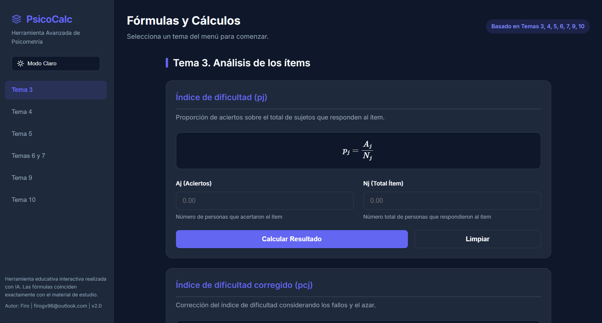

# PsicoCalc - Calculadora de Psicometría

## 📖 Sobre el Proyecto

**PsicoCalc** es una herramienta web interactiva, desarrollada de forma totalmente independiente con fines didácticos y de estudio. Ha sido programada con el apoyo de Inteligencia Artificial (IA) para servir como un **material de apoyo docente complementario** para los estudiantes de la asignatura de **Psicometría** en la carrera de **Psicología** la **UNIR** (Universidad Internacional de La Rioja).

El propósito principal de esta aplicación es agilizar la consulta de fórmulas (Temas 3, 4, 5, 6, 7, 9, 10) y facilitar la comprobación de ejercicios prácticos, brindando una experiencia visual moderna, accesible e intuitiva para los estudiantes.

## ⚠️ Descargo de Responsabilidad (Aviso Importante)

**ATENCIÓN ESTUDIANTES:**

- Esta herramienta **NO está pensada para sustituir** el aprendizaje de las fórmulas ni los métodos de cálculo oficiales o el uso de software estadístico y herramientas profesionales.
- La aplicación se ofrece "tal cual" (_as is_). El creador **no se responsabiliza por posibles resultados erróneos**, fallos en el código o malas interpretaciones.
- Es responsabilidad pura y exclusiva del estudiante **verificar y contrastar siempre** los cálculos obtenidos en esta página utilizando otros métodos académicos tradicionales.

## 🛠️ Tecnologías y Librerías Utilizadas

El desarrollo del proyecto está basado en un _stack_ minimalista y sin dependencias pesadas, lo que permite que se ejecute muy rápido directamente en cualquier navegador:

- **HTML5 & CSS3:** Estructuración semántica y diseño visual mediante la implementación de variables CSS para el manejo adaptativo de Modo Claro / Modo Oscuro y adaptación dinámica a dispositivos móviles.
- **JavaScript (Vanilla JS):** Motor de cálculo, validación de inputs y manejo del estado e interacciones de la UI.
- **[MathJax 3](https://www.mathjax.org/):** Librería externa (cargada por CDN) utilizada para el renderizado profesional de las ecuaciones matemáticas en notación LaTeX directamente renderizada sobre la web.
- **[Google Fonts (Inter)](https://fonts.google.com/specimen/Inter):** Familia tipográfica de alta legibilidad adoptada para mejorar la estética de la lectura.

## 📄 Licencia y Reconocimientos

Esta herramienta fomenta el desarrollo abierto y el estudio colaborativo. Puedes utilizar, inspeccionar y modificar el código para tu propio aprendizaje.

Si decides generar versiones derivadas, **se agradece y se solicita amablemente que el autor original sea citado** en las futuras versiones o usos de la herramienta.

- **Diseño y Desarrollo:** Firo (`firogv96@outlook.com`)
- **Asistencia de IA:** Desarrollado con inteligencia artificial en Antigravity con Gemini.
- **Versión:** 2.0

> _Proyecto creado como iniciativa independiente para la comunidad estudiantil._
